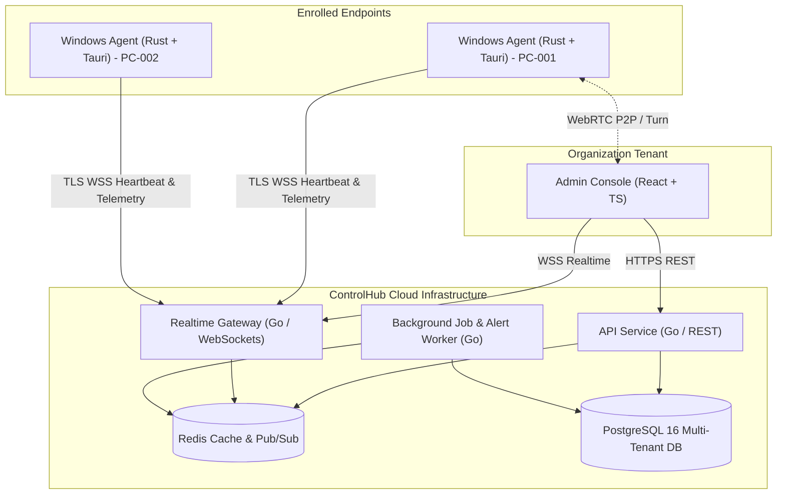

# ControlHub

**Enterprise Authorized B2B Remote Device Monitoring and Management Platform**

ControlHub provides organizations (such as computer training centers, examination centers, schools and colleges, small businesses, and Managed Service Providers) with a secure, centralized console for managing and monitoring explicitly enrolled computers.

---

## Core System Architecture & Security Boundary

ControlHub operates on a zero-trust endpoint model:
- **Strict Authorization**: Only explicitly enrolled computers authenticated with cryptographic device identities are manageable. Public identifiers such as IP address, MAC address, hostname, or serial number are never sufficient for authentication.
- **Transparency & Consent**: Active remote support sessions are clearly indicated on the endpoint via persistent visual cues and optional endpoint user consent. Hidden surveillance, unauthorized access, stealth persistence, and unauthenticated shells are strictly prevented.
- **Multi-Tenant Isolation**: Complete logical and relational boundary isolation across tenant organizations. Every entity is tenant-scoped and verified at the backend API layer.



---

## Repository Structure

```
controlhub/
├── apps/
│   ├── admin-console/        # React + TypeScript administration dashboard
│   └── windows-agent/        # Rust + Tauri native endpoint agent
├── services/
│   ├── api/                  # Go REST API (Authentication, RBAC, Devices, Groups, Audit)
│   ├── realtime/             # Go WebSocket hub for telemetry streaming & WebRTC signaling
│   ├── worker/               # Go asynchronous job runner, threshold alert evaluator
│   └── licensing/            # Entitlement and license signature verification service
├── packages/
│   ├── contracts/            # Protocol buffer / JSON schemas for API & WebSocket events
│   ├── auth/                 # Shared JWT & Argon2id cryptographic primitives
│   └── shared/               # Shared domain entities, error codes, and utilities
├── database/
│   ├── migrations/           # Up/Down SQL migrations (PostgreSQL)
│   └── seeds/                # Initial seed data for test organizations & RBAC roles
├── infrastructure/
│   ├── docker/               # Dockerfiles and Docker Compose configs
│   └── deployment/           # Production Helm / Kubernetes manifests
├── docs/                     # Comprehensive architectural & engineering specifications
│   ├── requirements/         # Product requirements & boundary definitions
│   ├── architecture/         # System, Security, Monitoring, and Session architectures
│   ├── api/                  # REST API & WebSocket event specifications
│   └── security/             # Threat model, RBAC matrix, and audit guidelines
└── tests/
    ├── unit/                 # Unit test suites across Go, Rust, and TypeScript
    ├── integration/          # Multi-tenant boundary and API integration tests
    ├── security/             # Auth token replay, RBAC evasion, and crypto validation tests
    └── e2e/                  # End-to-end device enrollment and heartbeat simulation
```

---

## Technical Specifications Index

Comprehensive architectural documents located in [`docs/`](./docs/):
1. [Product Requirements Document](./docs/PRODUCT_REQUIREMENTS.md)
2. [System Architecture Document](./docs/SYSTEM_ARCHITECTURE.md)
3. [Security Architecture & Boundary](./docs/SECURITY_ARCHITECTURE.md)
4. [STRIDE Threat Model & Mitigations](./docs/THREAT_MODEL.md)
5. [Database Design & ER Model](./docs/DATABASE_DESIGN.md)
6. [API Specification (REST & RPC)](./docs/API_SPECIFICATION.md)
7. [Authentication & RBAC Design](./docs/AUTHENTICATION_DESIGN.md)
8. [Device Enrollment & Cryptographic Identity](./docs/DEVICE_ENROLLMENT.md)
9. [Remote Session & WebRTC Architecture](./docs/REMOTE_SESSION_DESIGN.md)
10. [Monitoring & Telemetry Pipeline](./docs/MONITORING_DESIGN.md)
11. [Device Group Management](./docs/GROUP_MANAGEMENT.md)
12. [Job Pipeline & Command Execution](./docs/JOB_SYSTEM.md)
13. [Audit Logging Specification](./docs/AUDIT_LOGGING.md)
14. [Licensing & Entitlement Model](./docs/LICENSING_DESIGN.md)
15. [Secure Agent Update Subsystem](./docs/UPDATE_SYSTEM.md)
16. [Deployment & Infrastructure Guide](./docs/DEPLOYMENT.md)
17. [Testing Strategy & Test Matrix](./docs/TESTING_STRATEGY.md)
18. [Development Roadmap & Milestones](./docs/DEVELOPMENT_ROADMAP.md)

---

## Quickstart (Development Environment)

### Prerequisites
- Docker & Docker Compose
- Go 1.22+
- Node.js 20+ & npm / pnpm
- Rust 1.78+ (Cargo)

### Launch Local Infrastructure
```powershell
cd infrastructure/docker
docker compose up -d postgres redis
```

### Database Migration & Seed
```powershell
cd ../../
# Run migrations against localhost:5432
go run services/api/cmd/migrate/main.go up
```
