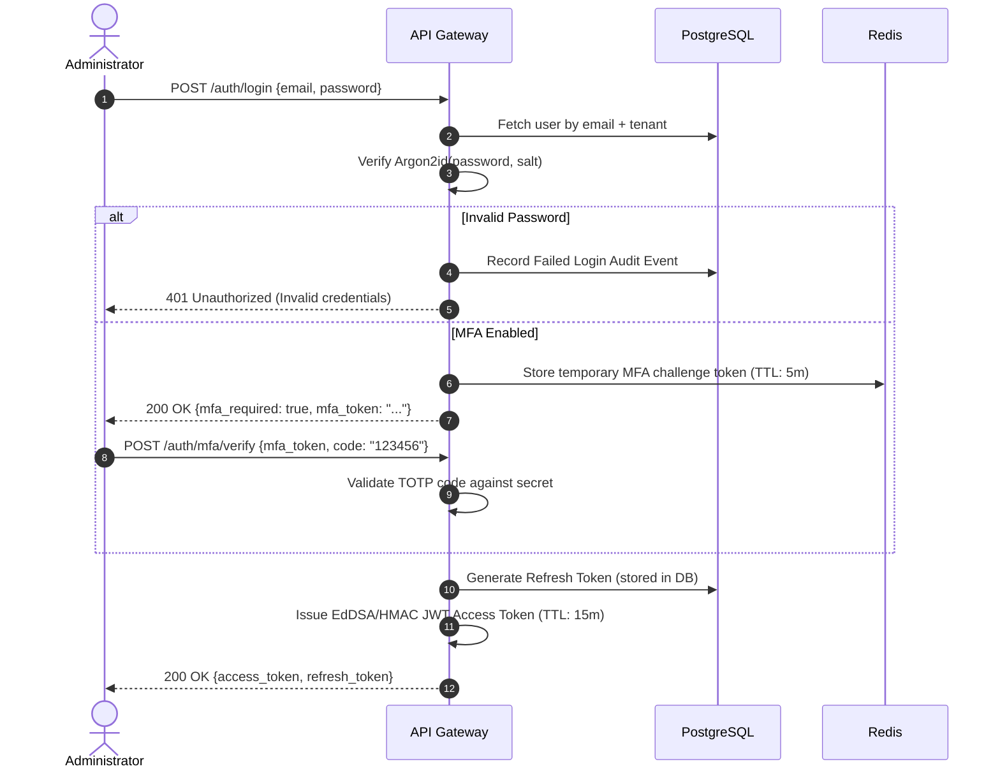

# ControlHub: Authentication & RBAC Design

## 1. Authentication Architecture

ControlHub implements enterprise authentication with MFA support, token rotation, and granular Role-Based Access Control (RBAC).



---

## 2. Cryptographic Specifications

### 2.1 Password Storage (Argon2id)
- **Algorithm**: Argon2id
- **Time Cost (Iterations)**: 3
- **Memory Cost**: 65,536 KiB (64 MiB)
- **Parallelism**: 4 threads
- **Salt Length**: 16 bytes (generated using `crypto/rand`)
- **Key Length**: 32 bytes

### 2.2 Time-Based One-Time Password (TOTP)
- **Standard**: RFC 6238 (HMAC-SHA1, 6 digits, 30-second time step).
- **Secret Generation**: 20 bytes (160 bits) encoded in base32.
- **Recovery Codes**: 8 single-use 10-character alphanumeric recovery codes, hashed with SHA-256 before storage in the database.

### 2.3 JWT Claims Structure
```json
{
  "sub": "c1f72776-9ec6-4f40-8b17-7435f3dfd720",
  "org_id": "771e8bfb-cf98-4c28-98e3-0d6e6443c21a",
  "role": "Administrator",
  "permissions": [
    "device.view",
    "device.enroll",
    "device.approve",
    "device.remote",
    "group.manage"
  ],
  "iss": "controlhub-auth-service",
  "iat": 1788912000,
  "exp": 1788912900
}
```

---

## 3. Role-Based Access Control (RBAC) Permission Matrix

| Permission String | Description | Owner | Administrator | IT Support | Operator | Viewer |
| :--- | :--- | :---: | :---: | :---: | :---: | :---: |
| `organization.view` | View organization details & settings | Yes | Yes | Yes | Yes | Yes |
| `organization.manage`| Update organization policies & settings | Yes | Yes | No | No | No |
| `user.view` | View users and roles in organization | Yes | Yes | Yes | No | No |
| `user.manage` | Create, invite, update, or deactivate users | Yes | Yes | No | No | No |
| `device.view` | View device inventory and health stats | Yes | Yes | Yes | Yes | Yes |
| `device.enroll` | Generate device enrollment invitations | Yes | Yes | No | No | No |
| `device.approve` | Approve pending devices into inventory | Yes | Yes | No | No | No |
| `device.remove` | Revoke and delete enrolled devices | Yes | Yes | No | No | No |
| `device.remote` | Initiate WebRTC remote desktop sessions | Yes | Yes | Yes | No | No |
| `device.file_transfer`| Upload or download files on device | Yes | Yes | Yes | No | No |
| `device.terminal` | Run interactive terminal or queued commands | Yes | Yes | Yes | No | No |
| `device.restart` | Trigger reboot or shutdown on endpoint | Yes | Yes | Yes | No | No |
| `device.software_manage` | Deploy software packages or updates | Yes | Yes | No | No | No |
| `group.view` | View device groups and hierarchies | Yes | Yes | Yes | Yes | Yes |
| `group.manage` | Create, edit, or delete device groups | Yes | Yes | No | No | No |
| `group.assign_device` | Move devices between groups | Yes | Yes | Yes | No | No |
| `alert.view` | View device health alerts | Yes | Yes | Yes | Yes | Yes |
| `alert.manage` | Acknowledge or dismiss alerts | Yes | Yes | Yes | Yes | No |
| `audit.view` | View immutable audit trail records | Yes | Yes | No | No | No |
| `license.view` | View license tier, limits and entitlements | Yes | Yes | Yes | No | No |
| `license.manage` | Purchase or update organization license | Yes | No | No | No | No |

---

## 4. Session Invalidation & Revocation

- **Immediate Logout**: Calling `POST /auth/logout` stores the JWT token ID (`jti`) into Redis with TTL matching token expiry. Middleware rejects blacklisted tokens.
- **Refresh Token Invalidation**: Modifying user password or administrative revocation invalidates all active refresh tokens for that user ID in PostgreSQL.
- **Brute-Force Rate Limiting**:
  - Maximum 5 failed password attempts per 15-minute window per IP and email.
  - Accounts locked for 15 minutes after threshold breaches.
