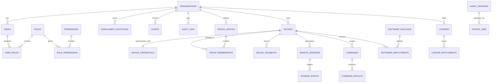

# ControlHub: Database Schema & Entity-Relationship Design

## 1. Entity-Relationship Diagram



---

## 2. Table Specifications & Data Dictionary

### 2.1 Core Multi-Tenancy & Identity

#### `organizations`
Represents an isolated customer tenant (e.g. training center, school, exam center).
```sql
CREATE TABLE organizations (
    id UUID PRIMARY KEY DEFAULT gen_random_uuid(),
    name VARCHAR(255) NOT NULL,
    slug VARCHAR(100) NOT NULL UNIQUE,
    status VARCHAR(50) NOT NULL DEFAULT 'ACTIVE', -- ACTIVE, SUSPENDED, TRIAL
    created_at TIMESTAMPTZ NOT NULL DEFAULT NOW(),
    updated_at TIMESTAMPTZ NOT NULL DEFAULT NOW()
);
CREATE INDEX idx_organizations_status ON organizations(status);
```

#### `users`
Administrative console operators and users.
```sql
CREATE TABLE users (
    id UUID PRIMARY KEY DEFAULT gen_random_uuid(),
    organization_id UUID NOT NULL REFERENCES organizations(id) ON DELETE CASCADE,
    email VARCHAR(255) NOT NULL,
    password_hash VARCHAR(255) NOT NULL, -- Argon2id hash
    full_name VARCHAR(255) NOT NULL,
    mfa_enabled BOOLEAN NOT NULL DEFAULT FALSE,
    mfa_secret VARCHAR(255), -- Encrypted TOTP secret
    status VARCHAR(50) NOT NULL DEFAULT 'ACTIVE', -- ACTIVE, INVITED, DISABLED
    last_login_at TIMESTAMPTZ,
    created_at TIMESTAMPTZ NOT NULL DEFAULT NOW(),
    updated_at TIMESTAMPTZ NOT NULL DEFAULT NOW(),
    CONSTRAINT uq_users_org_email UNIQUE(organization_id, email)
);
CREATE INDEX idx_users_org_id ON users(organization_id);
```

#### `roles` & `permissions`
Granular Role-Based Access Control definitions.
```sql
CREATE TABLE permissions (
    id VARCHAR(100) PRIMARY KEY, -- e.g. 'device.remote', 'device.restart'
    category VARCHAR(50) NOT NULL,
    description TEXT NOT NULL
);

CREATE TABLE roles (
    id UUID PRIMARY KEY DEFAULT gen_random_uuid(),
    organization_id UUID REFERENCES organizations(id) ON DELETE CASCADE, -- NULL for system default roles
    name VARCHAR(100) NOT NULL, -- Owner, Administrator, IT Support, Operator, Viewer
    is_system_role BOOLEAN NOT NULL DEFAULT FALSE,
    created_at TIMESTAMPTZ NOT NULL DEFAULT NOW()
);

CREATE TABLE role_permissions (
    role_id UUID NOT NULL REFERENCES roles(id) ON DELETE CASCADE,
    permission_id VARCHAR(100) NOT NULL REFERENCES permissions(id) ON DELETE CASCADE,
    PRIMARY KEY (role_id, permission_id)
);

CREATE TABLE user_roles (
    user_id UUID NOT NULL REFERENCES users(id) ON DELETE CASCADE,
    role_id UUID NOT NULL REFERENCES roles(id) ON DELETE CASCADE,
    PRIMARY KEY (user_id, role_id)
);
```

---

### 2.2 Devices & Endpoint Identity

#### `devices`
Managed endpoints explicitly enrolled into an organization.
```sql
CREATE TABLE devices (
    id UUID PRIMARY KEY DEFAULT gen_random_uuid(),
    organization_id UUID NOT NULL REFERENCES organizations(id) ON DELETE CASCADE,
    hostname VARCHAR(255) NOT NULL,
    friendly_name VARCHAR(255),
    os_name VARCHAR(100) NOT NULL, -- Windows 11 Pro, etc.
    os_version VARCHAR(100) NOT NULL,
    os_architecture VARCHAR(50) NOT NULL, -- x86_64, aarch64
    agent_version VARCHAR(50) NOT NULL,
    status VARCHAR(50) NOT NULL DEFAULT 'PENDING', -- PENDING, ACTIVE, OFFLINE, DISABLED, REVOKED
    ip_address_public INET,
    ip_address_local INET,
    mac_address VARCHAR(50),
    serial_number VARCHAR(100),
    last_seen TIMESTAMPTZ,
    uptime_seconds BIGINT DEFAULT 0,
    created_at TIMESTAMPTZ NOT NULL DEFAULT NOW(),
    updated_at TIMESTAMPTZ NOT NULL DEFAULT NOW()
);
CREATE INDEX idx_devices_org_status ON devices(organization_id, status);
CREATE INDEX idx_devices_last_seen ON devices(organization_id, last_seen);
```

#### `device_credentials`
Stores cryptographic public keys for device mutual authentication.
```sql
CREATE TABLE device_credentials (
    device_id UUID PRIMARY KEY REFERENCES devices(id) ON DELETE CASCADE,
    public_key_type VARCHAR(50) NOT NULL DEFAULT 'ED25519',
    public_key_bytes BYTEA NOT NULL,
    enrolled_at TIMESTAMPTZ NOT NULL DEFAULT NOW(),
    revoked_at TIMESTAMPTZ
);
```

#### `device_groups` & `group_memberships`
Hierarchical lab, classroom, or department groupings.
```sql
CREATE TABLE device_groups (
    id UUID PRIMARY KEY DEFAULT gen_random_uuid(),
    organization_id UUID NOT NULL REFERENCES organizations(id) ON DELETE CASCADE,
    parent_group_id UUID REFERENCES device_groups(id) ON DELETE CASCADE,
    name VARCHAR(255) NOT NULL,
    description TEXT,
    created_at TIMESTAMPTZ NOT NULL DEFAULT NOW(),
    CONSTRAINT uq_group_org_name UNIQUE(organization_id, name)
);

CREATE TABLE group_memberships (
    group_id UUID NOT NULL REFERENCES device_groups(id) ON DELETE CASCADE,
    device_id UUID NOT NULL REFERENCES devices(id) ON DELETE CASCADE,
    assigned_at TIMESTAMPTZ NOT NULL DEFAULT NOW(),
    PRIMARY KEY(group_id, device_id)
);
CREATE INDEX idx_group_memberships_device ON group_memberships(device_id);
```

#### `enrollment_invitations`
Cryptographically secure one-time or time-bound invitation tokens.
```sql
CREATE TABLE enrollment_invitations (
    id UUID PRIMARY KEY DEFAULT gen_random_uuid(),
    organization_id UUID NOT NULL REFERENCES organizations(id) ON DELETE CASCADE,
    token_hash VARCHAR(255) NOT NULL UNIQUE, -- SHA-256 hash of plaintext token
    target_group_id UUID REFERENCES device_groups(id) ON DELETE SET NULL,
    requires_approval BOOLEAN NOT NULL DEFAULT TRUE,
    max_uses INT NOT NULL DEFAULT 1,
    times_used INT NOT NULL DEFAULT 0,
    expires_at TIMESTAMPTZ NOT NULL,
    created_by_user_id UUID REFERENCES users(id) ON DELETE SET NULL,
    created_at TIMESTAMPTZ NOT NULL DEFAULT NOW()
);
CREATE INDEX idx_enrollment_org_exp ON enrollment_invitations(organization_id, expires_at);
```

---

### 2.3 Telemetry, Remote Sessions & Jobs

#### `device_telemetry`
Aggregated timeseries records for device hardware health.
```sql
CREATE TABLE device_telemetry (
    id BIGSERIAL PRIMARY KEY,
    organization_id UUID NOT NULL REFERENCES organizations(id) ON DELETE CASCADE,
    device_id UUID NOT NULL REFERENCES devices(id) ON DELETE CASCADE,
    cpu_percent NUMERIC(5,2) NOT NULL,
    ram_used_bytes BIGINT NOT NULL,
    ram_total_bytes BIGINT NOT NULL,
    ram_percent NUMERIC(5,2) NOT NULL,
    disk_used_bytes BIGINT NOT NULL,
    disk_total_bytes BIGINT NOT NULL,
    disk_percent NUMERIC(5,2) NOT NULL,
    network_rx_bytes_sec BIGINT DEFAULT 0,
    network_tx_bytes_sec BIGINT DEFAULT 0,
    recorded_at TIMESTAMPTZ NOT NULL DEFAULT NOW()
);
CREATE INDEX idx_telemetry_device_time ON device_telemetry(device_id, recorded_at DESC);
CREATE INDEX idx_telemetry_org_time ON device_telemetry(organization_id, recorded_at DESC);
```

#### `remote_sessions` & `session_events`
Authorized WebRTC remote desktop sessions and lifecycle audits.
```sql
CREATE TABLE remote_sessions (
    id UUID PRIMARY KEY DEFAULT gen_random_uuid(),
    organization_id UUID NOT NULL REFERENCES organizations(id) ON DELETE CASCADE,
    device_id UUID NOT NULL REFERENCES devices(id) ON DELETE CASCADE,
    operator_user_id UUID NOT NULL REFERENCES users(id) ON DELETE CASCADE,
    session_status VARCHAR(50) NOT NULL DEFAULT 'REQUESTED', -- REQUESTED, CONNECTED, REJECTED, TERMINATED
    started_at TIMESTAMPTZ,
    ended_at TIMESTAMPTZ,
    termination_reason VARCHAR(255),
    created_at TIMESTAMPTZ NOT NULL DEFAULT NOW()
);
CREATE INDEX idx_remote_sessions_device ON remote_sessions(device_id);

CREATE TABLE session_events (
    id BIGSERIAL PRIMARY KEY,
    session_id UUID NOT NULL REFERENCES remote_sessions(id) ON DELETE CASCADE,
    event_type VARCHAR(100) NOT NULL, -- CONSENT_REQUESTED, CONSENT_GRANTED, VIDEO_STARTED, INPUT_ENABLED
    payload JSONB,
    created_at TIMESTAMPTZ NOT NULL DEFAULT NOW()
);
```

#### `commands` & `command_results`
Controlled, authenticated job queue execution pipeline.
```sql
CREATE TABLE commands (
    id UUID PRIMARY KEY DEFAULT gen_random_uuid(),
    organization_id UUID NOT NULL REFERENCES organizations(id) ON DELETE CASCADE,
    device_id UUID NOT NULL REFERENCES devices(id) ON DELETE CASCADE,
    issued_by_user_id UUID NOT NULL REFERENCES users(id) ON DELETE CASCADE,
    command_type VARCHAR(100) NOT NULL, -- REBOOT, SHUTDOWN, RUN_SCRIPT, FILE_DOWNLOAD
    parameters JSONB NOT NULL DEFAULT '{}',
    status VARCHAR(50) NOT NULL DEFAULT 'QUEUED', -- QUEUED, DISPATCHED, RUNNING, SUCCESS, FAILED, CANCELLED
    expires_at TIMESTAMPTZ NOT NULL,
    created_at TIMESTAMPTZ NOT NULL DEFAULT NOW()
);
CREATE INDEX idx_commands_device_status ON commands(device_id, status);

CREATE TABLE command_results (
    command_id UUID PRIMARY KEY REFERENCES commands(id) ON DELETE CASCADE,
    exit_code INT,
    stdout_output TEXT,
    stderr_output TEXT,
    execution_duration_ms INT,
    completed_at TIMESTAMPTZ NOT NULL DEFAULT NOW()
);
```

---

### 2.4 Governance, Licensing & Updates

#### `alerts`
Configurable threshold trigger events.
```sql
CREATE TABLE alerts (
    id UUID PRIMARY KEY DEFAULT gen_random_uuid(),
    organization_id UUID NOT NULL REFERENCES organizations(id) ON DELETE CASCADE,
    device_id UUID REFERENCES devices(id) ON DELETE CASCADE,
    severity VARCHAR(50) NOT NULL DEFAULT 'WARNING', -- INFO, WARNING, CRITICAL
    alert_type VARCHAR(100) NOT NULL, -- CPU_HIGH, DISK_FULL, DEVICE_OFFLINE
    title VARCHAR(255) NOT NULL,
    details TEXT,
    acknowledged BOOLEAN NOT NULL DEFAULT FALSE,
    acknowledged_by UUID REFERENCES users(id) ON DELETE SET NULL,
    acknowledged_at TIMESTAMPTZ,
    created_at TIMESTAMPTZ NOT NULL DEFAULT NOW()
);
CREATE INDEX idx_alerts_org_ack ON alerts(organization_id, acknowledged, created_at DESC);
```

#### `audit_logs`
Immutable compliance and security event ledger.
```sql
CREATE TABLE audit_logs (
    id BIGSERIAL PRIMARY KEY,
    organization_id UUID NOT NULL REFERENCES organizations(id) ON DELETE CASCADE,
    actor_user_id UUID REFERENCES users(id) ON DELETE SET NULL,
    action VARCHAR(100) NOT NULL, -- auth.login, device.approve, session.start, command.execute
    resource_type VARCHAR(100) NOT NULL, -- user, device, session, command, license
    resource_id VARCHAR(255) NOT NULL,
    ip_address INET,
    user_agent TEXT,
    status VARCHAR(50) NOT NULL, -- SUCCESS, FAILURE, DENIED
    metadata JSONB NOT NULL DEFAULT '{}',
    created_at TIMESTAMPTZ NOT NULL DEFAULT NOW()
);
CREATE INDEX idx_audit_org_action ON audit_logs(organization_id, action, created_at DESC);
```

#### `licenses` & `license_entitlements`
Commercial subscription tracking and offline grace caches.
```sql
CREATE TABLE licenses (
    id UUID PRIMARY KEY DEFAULT gen_random_uuid(),
    organization_id UUID NOT NULL REFERENCES organizations(id) ON DELETE CASCADE,
    plan_code VARCHAR(100) NOT NULL, -- FREE_TRIAL, PLAN_5, PLAN_25, PLAN_50, PLAN_100, ENTERPRISE
    max_devices INT NOT NULL DEFAULT 5,
    features JSONB NOT NULL DEFAULT '[]',
    valid_from TIMESTAMPTZ NOT NULL,
    valid_until TIMESTAMPTZ NOT NULL,
    grace_period_days INT NOT NULL DEFAULT 7,
    signature BYTEA NOT NULL, -- Signed platform cryptographic license token
    created_at TIMESTAMPTZ NOT NULL DEFAULT NOW()
);
```

#### `software_packages`, `agent_versions` & `update_jobs`
Software inventory tracking and cryptographic agent self-update records.
```sql
CREATE TABLE software_packages (
    id UUID PRIMARY KEY DEFAULT gen_random_uuid(),
    organization_id UUID NOT NULL REFERENCES organizations(id) ON DELETE CASCADE,
    name VARCHAR(255) NOT NULL,
    version VARCHAR(100) NOT NULL,
    installer_url TEXT NOT NULL,
    sha256_hash VARCHAR(64) NOT NULL,
    silent_install_args TEXT,
    created_at TIMESTAMPTZ NOT NULL DEFAULT NOW()
);

CREATE TABLE software_deployments (
    id UUID PRIMARY KEY DEFAULT gen_random_uuid(),
    organization_id UUID NOT NULL REFERENCES organizations(id) ON DELETE CASCADE,
    package_id UUID NOT NULL REFERENCES software_packages(id) ON DELETE CASCADE,
    device_id UUID NOT NULL REFERENCES devices(id) ON DELETE CASCADE,
    status VARCHAR(50) NOT NULL DEFAULT 'QUEUED',
    created_at TIMESTAMPTZ NOT NULL DEFAULT NOW()
);

CREATE TABLE agent_versions (
    version VARCHAR(50) PRIMARY KEY,
    release_notes TEXT,
    binary_url TEXT NOT NULL,
    sha256_hash VARCHAR(64) NOT NULL,
    signature_bytes BYTEA NOT NULL, -- Platform Ed25519 signature
    released_at TIMESTAMPTZ NOT NULL DEFAULT NOW()
);

CREATE TABLE update_jobs (
    id UUID PRIMARY KEY DEFAULT gen_random_uuid(),
    device_id UUID NOT NULL REFERENCES devices(id) ON DELETE CASCADE,
    target_version VARCHAR(50) NOT NULL REFERENCES agent_versions(version),
    status VARCHAR(50) NOT NULL DEFAULT 'PENDING',
    created_at TIMESTAMPTZ NOT NULL DEFAULT NOW()
);
```
