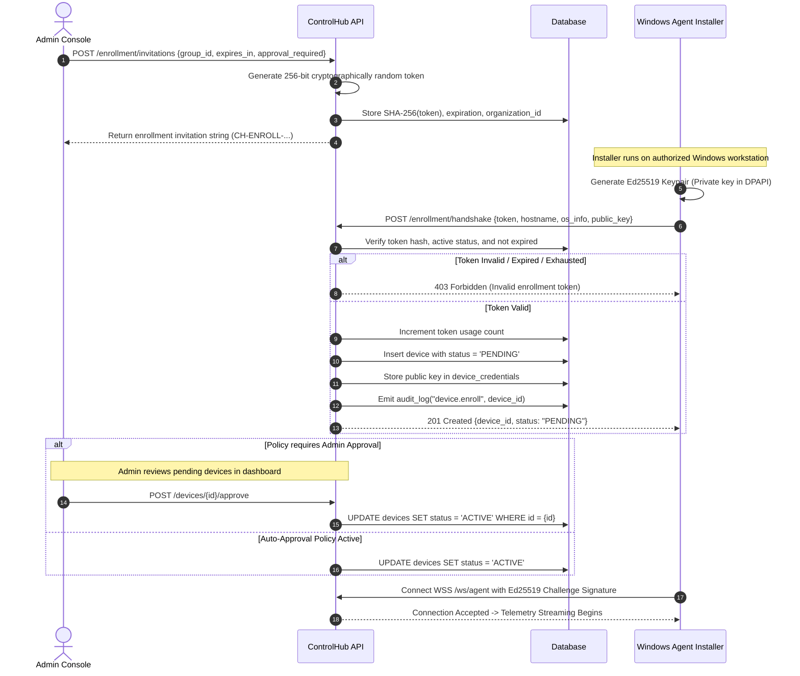
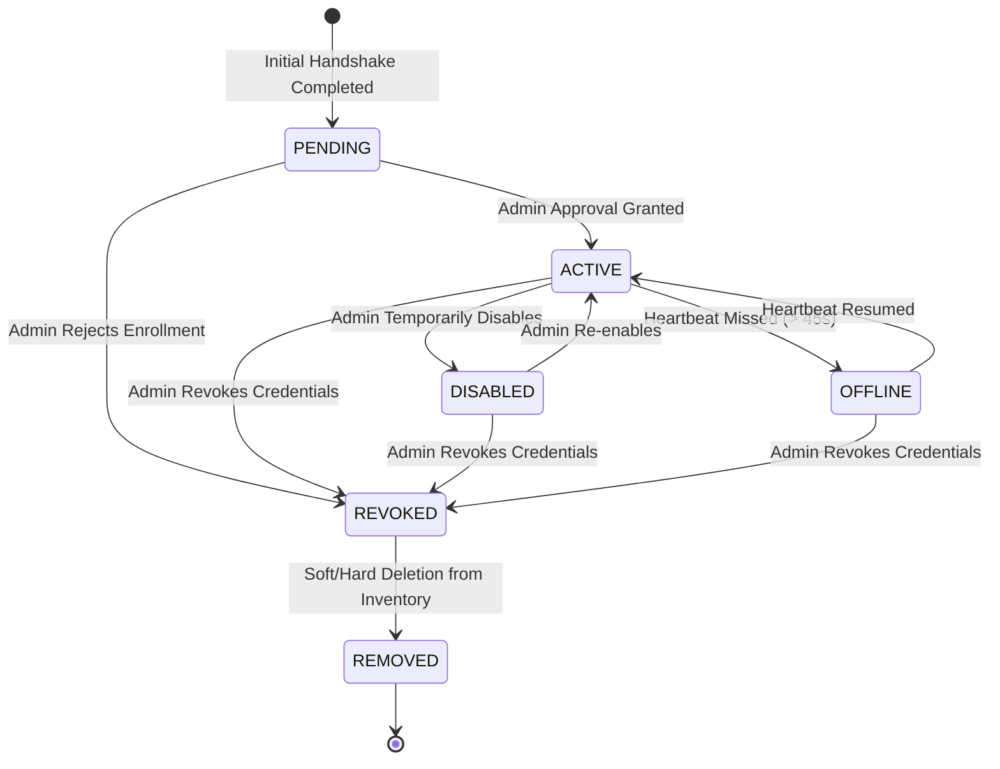

# ControlHub: Device Enrollment & Cryptographic Identity

## 1. Enrollment Overview & Security Boundary

Device enrollment is the foundational gate of the ControlHub zero-trust architecture. An endpoint computer can **never** be managed without completing this cryptographic enrollment protocol.

---

## 2. Enrollment Token Properties

- **Entropy**: 256 bits generated via cryptographically secure pseudo-random number generator (`crypto/rand`).
- **Encoding**: Alphanumeric base32 or hex string prefixed with `CH-ENROLL-` for easy validation and scanning.
- **Hash-at-Rest**: The database **never** stores the raw plaintext invitation token. Only the `SHA-256` hash of the token is persisted.
- **Expiration**: Strict TTL (default: 24 hours, maximum 7 days).
- **Usage Limit**: Default single-use (`max_uses: 1`), configurable for bulk laboratory deployments with an explicit limit (e.g., 30 uses for Computer Lab 2).
- **Tenant & Group Binding**: Bound permanently to the issuing `organization_id` and optional target `device_group_id`.

---

## 3. Cryptographic Device Identity & Keystore

1. **Algorithm**: **Ed25519** (RFC 8032 Edwards-curve Digital Signature Algorithm).
2. **Key Generation**: Executed locally on the Windows machine during agent first run.
3. **Private Key Storage on Windows**:
   - Stored in `%ProgramData%\ControlHub\keys\identity.key`.
   - Encrypted with Windows DPAPI (`CryptProtectData`) using `CRYPTPROTECT_LOCAL_MACHINE` scope.
   - Access Control List (ACL) restricted strictly to `NT AUTHORITY\SYSTEM` and `BUILTIN\Administrators`.
   - The private key is non-exportable and is never transmitted over the network.
4. **Public Key Registration**:
   - 32-byte raw public key transmitted during the TLS handshake to the backend.

---

## 4. Device Lifecycle State Machine

### State Definitions:
- **`PENDING`**: Device registered its identity and hardware specs but awaits administrator approval.
- **`ACTIVE`**: Fully authorized. Telemetry, remote assistance, and maintenance commands are allowed.
- **`OFFLINE`**: Device is active in inventory but has disconnected from the realtime gateway.
- **`DISABLED`**: Device is administratively silenced; agent connections are rejected with code 403.
- **`REVOKED`**: Cryptographic credentials invalidated; cannot reconnect without fresh re-enrollment.
- **`REMOVED`**: Deleted from organization inventory and archived in compliance audit logs.
