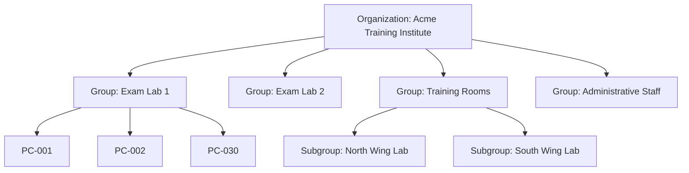

# ControlHub: Device Group Management & Hierarchies

## 1. Group Structure & Hierarchy

Organizations often manage workstations divided across physical locations, departments, or computer laboratories (e.g. Exam Labs, Training Rooms, Office Workstations).



---

## 2. Relational Schema & Hierarchy Representation

Groups are structured hierarchically using an adjacency list model with `parent_group_id`:
```sql
CREATE TABLE device_groups (
    id UUID PRIMARY KEY DEFAULT gen_random_uuid(),
    organization_id UUID NOT NULL REFERENCES organizations(id) ON DELETE CASCADE,
    parent_group_id UUID REFERENCES device_groups(id) ON DELETE CASCADE,
    name VARCHAR(255) NOT NULL,
    description TEXT,
    policy_overrides JSONB DEFAULT '{}',
    created_at TIMESTAMPTZ NOT NULL DEFAULT NOW()
);
```

### Policy Inheritance
Subgroups inherit security and operational policies from parent groups unless explicitly overridden.
- **Example Policies**:
  - `prompt_for_remote_consent`: `true` (Enforce local user consent before remote control)
  - `allowed_remote_times`: `08:00 - 18:00` (Restrict remote control to business hours)
  - `telemetry_frequency_sec`: `15`
  - `alert_cpu_threshold`: `90%`

---

## 3. Group Operations & Workflows

### 3.1 Group Lifecycle
- **Create Group**: `POST /groups` creates a named container bound to the organization.
- **Rename & Update**: `PATCH /groups/{id}` allows changing name, description, and policy parameters.
- **Delete Group**: `DELETE /groups/{id}` removes the container; member devices are safely unassigned rather than deleted.

### 3.2 Device Assignment
- Devices can belong to one or more groups via `group_memberships`.
- Bulk assignment is supported: `POST /groups/{id}/devices` accepts an array of device IDs.
- Automatic assignment during enrollment: Enrollment tokens can be pre-associated with a group, placing new machines directly into their designated classroom or lab upon enrollment.

### 3.3 Group-Level Health & Monitoring
- Console displays aggregated health for each group:
  - **Online Ratio** (e.g. `28/30 Online` for Exam Lab 1)
  - **Group Average CPU / RAM Load**
  - **Aggregated Active Alerts**
  - Instant filter to list only devices belonging to selected group.
