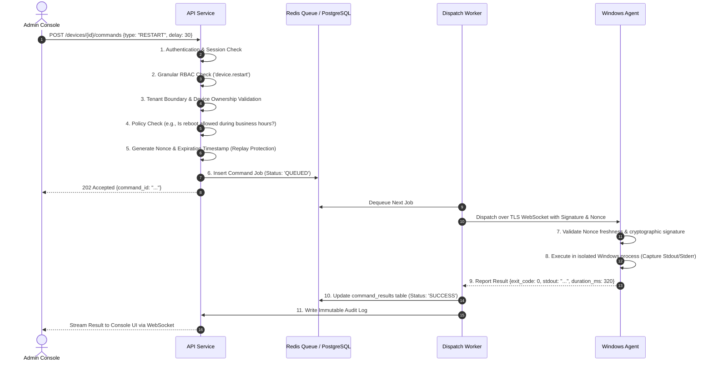
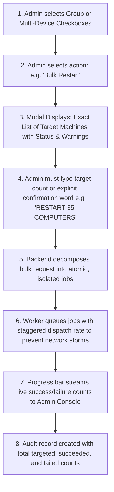

# ControlHub: Controlled Job Pipeline & Command Execution

## 1. Controlled Job Model Principles

> [!WARNING]
> ControlHub **never** opens an unauthenticated raw shell port (like SSH or telnet) on an endpoint. All commands follow a strictly validated, queued, and auditable job pipeline.

---

## 2. Replay Protection & Cryptographic Command Signing

Every command dispatched to an endpoint carries:
1. **`command_id`**: Unique UUIDv4.
2. **`issued_at` & `expires_at`**: Strict time window (commands expire in 5 minutes if offline).
3. **`nonce`**: Single-use random 128-bit value; endpoints cache recent nonces to prevent replay attacks.
4. **`payload_signature`**: HMAC-SHA256 or Ed25519 signature generated by the platform secret, verified by the agent before spawning any subprocess.

---

## 3. Safe Bulk Management Workflow

Bulk operations across hundreds of workstations (such as classroom restarts, software updates, or mass shutdowns) carry high operational risk if misconfigured. ControlHub enforces a **multi-stage confirmation gate**:

### Safety Protections:
- **Never Silent**: Bulk disruptive actions cannot be executed with a single click.
- **Staggered Dispatch**: Commands are dispatched with a configurable throttle (e.g. 10 devices per second) to avoid overwhelming local network switches or domain controllers.
- **Active User Warning**: If an interactive user is logged on, the command can automatically notify the user with a countdown dialog before restarting.
