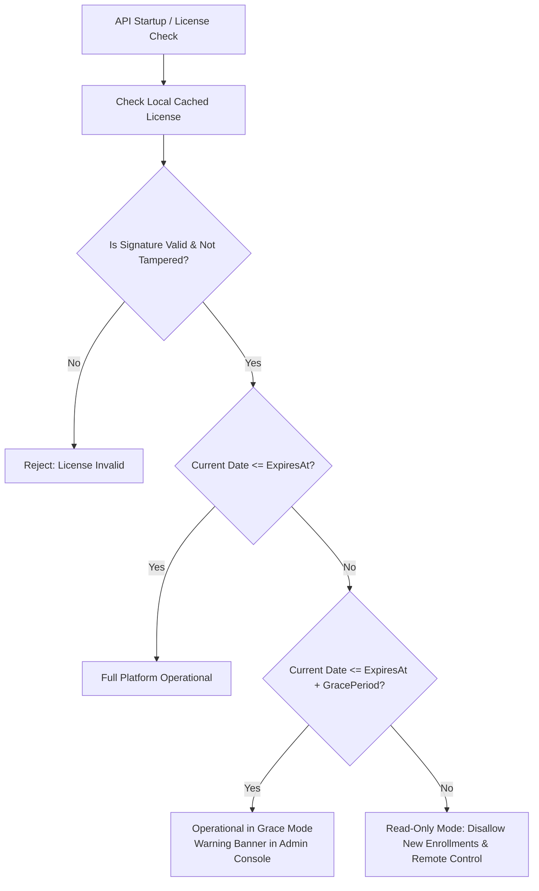

# ControlHub: Licensing & Entitlement Model

## 1. Subscription Tiers & Feature Matrix

ControlHub offers tiered plans tailored for small learning labs up to massive enterprise university and MSP deployments:

| Plan Tier | Max Enrolled Devices | Features Included | Support SLA |
| :--- | :---: | :--- | :--- |
| **Free Trial** | 5 | Health monitoring, telemetry, basic dashboard, 14-day history, 1 concurrent remote session | Community |
| **5-Device Plan** | 5 | All Free Trial features + unlimited history, priority telemetry, email alerts | Standard |
| **25-Device Plan** | 25 | All 5-device features + Group hierarchy, bulk restart, audit logs (90-day retention) | Business (24h) |
| **50-Device Plan** | 50 | All 25-device features + Software deployment, 5 concurrent remote sessions | Business (12h) |
| **100-Device Plan** | 100 | All 50-device features + Role-based permissions customization, 10 concurrent sessions | Premium (4h) |
| **Enterprise / Custom** | Unlimited | All features + Multi-tenant MSP portal, SAML/SSO, on-premise relay, dedicated support | 24/7 Dedicated |

---

## 2. Cryptographic License Verification

Licenses are signed by the ControlHub licensing authority using an asymmetric Ed25519 signing key. The API service validates licenses without requiring constant real-time phone-home pings to the billing gateway.

### License Token Structure (Signed JSON):
```json
{
  "license_id": "lic_990184a29c01",
  "organization_id": "771e8bfb-cf98-4c28-98e3-0d6e6443c21a",
  "organization_name": "Acme IT Academy",
  "plan": "PLAN_50",
  "device_limit": 50,
  "features": [
    "feature.remote_control",
    "feature.file_transfer",
    "feature.bulk_management",
    "feature.software_deployment",
    "feature.audit_logs"
  ],
  "issued_at": "2026-09-01T00:00:00Z",
  "expires_at": "2027-09-01T00:00:00Z",
  "signature": "c5f8841a99bc32e..."
}
```

---

## 3. Resilient Offline Grace Period

To ensure enterprise stability, temporary licensing-service outages or internet disconnections must **never** disrupt ongoing classroom operations or lock out administrators.



### Grace Period Rules:
- **Default Grace Period**: 7 days beyond the formal expiration date.
- **Grace Mode Behavior**:
  - Administrators are notified with a banner in the dashboard.
  - Active monitoring, existing device connections, and emergency troubleshooting continue uninterrupted.
  - New device enrollment and agent version upgrades are paused until renewal.
