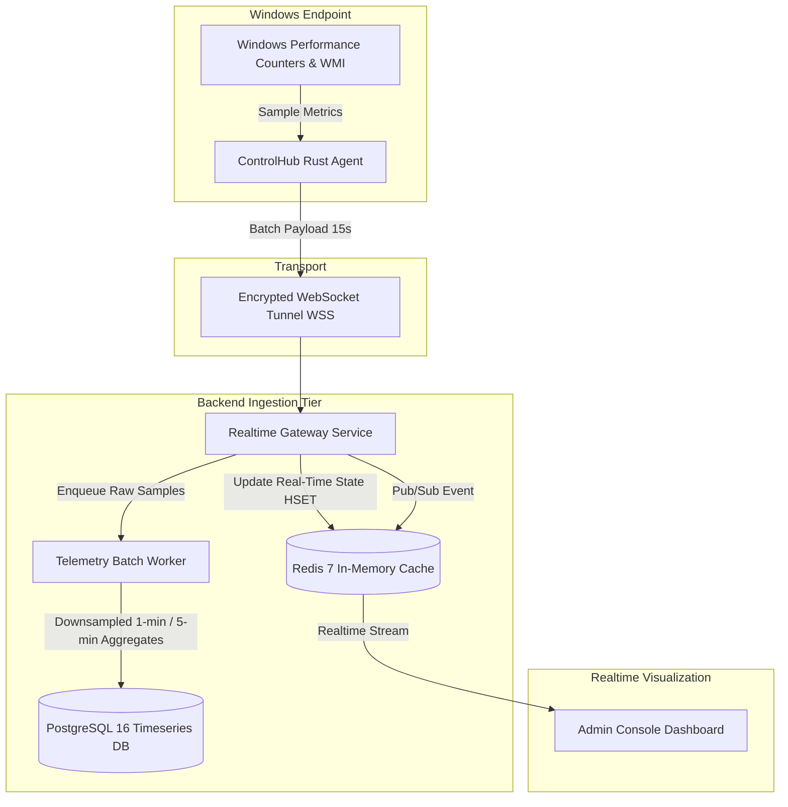

# ControlHub: Monitoring & Telemetry Architecture

## 1. Lightweight Telemetry Architecture

Rather than taxing network bandwidth with continuous screen streaming, ControlHub collects lightweight system telemetry at high efficiency.



---

## 2. Telemetry Payload Schema

Every 15 seconds, the agent collects and transmits an optimized JSON telemetry payload:

```json
{
  "device_id": "90e722c1-bb3e-4623-a128-44fb6b907a01",
  "timestamp": "2026-09-10T00:15:00Z",
  "metrics": {
    "cpu": {
      "percent": 24.8,
      "cores": 8,
      "frequency_mhz": 3200
    },
    "ram": {
      "used_bytes": 8589934592,
      "total_bytes": 17179869184,
      "percent": 50.0
    },
    "disk": [
      {
        "mount": "C:",
        "fs_type": "NTFS",
        "used_bytes": 128849018880,
        "total_bytes": 512000000000,
        "percent": 25.16
      }
    ],
    "network": {
      "interface_name": "Ethernet",
      "local_ip": "192.168.1.105",
      "rx_bytes_sec": 45020,
      "tx_bytes_sec": 12890
    },
    "system": {
      "uptime_seconds": 182400,
      "active_user": "STUDENT-04",
      "process_count": 142
    }
  }
}
```

---

## 3. Dual-Tier Storage Strategy

1. **Hot In-Memory Tier (Redis)**:
   - Key: `device:{device_id}:telemetry:latest`
   - Data: The most recent telemetry payload (TTL: 60 seconds).
   - Serves immediate queries when administrators navigate the dashboard or device view without touching PostgreSQL.
2. **Cold Durable Tier (PostgreSQL)**:
   - Background worker processes batches from Redis stream.
   - Saves 1-minute averaged summaries into `device_telemetry` table.
   - Automated partition cleanup: Keeps high-resolution data for 30 days, rolling into hourly averages for 1 year.

---

## 4. Heartbeat & Liveness State Detection

- **Agent Ping**: Agent sends a 1-byte WebSocket ping or heartbeat frame every 15 seconds.
- **Lease Expiry**: Gateway refreshes Redis lease `SETEX device:{id}:online 45 1`.
- **Offline Transition**: If no ping or telemetry is received for 45 seconds, the Redis key expires, triggering a keyspace notification or periodic worker check that marks device `status = 'OFFLINE'` and broadcasts `device.offline` event to the tenant console.

---

## 5. Dashboard Metrics & KPI Counters

The administrative console aggregates real-time fleet health into responsive KPI widgets:
- **Total Registered Devices**
- **Online Devices** (Connected & Heartbeating)
- **Offline Devices** (Disconnected)
- **Pending Devices** (Awaiting Enrollment Approval)
- **Active Remote Sessions** (Live WebRTC connections)
- **Active Alerts**:
  - CPU Threshold Alerts (CPU > 85% for > 5 min)
  - Memory Warnings (RAM > 90%)
  - Disk Space Critical (Free Space < 10%)
