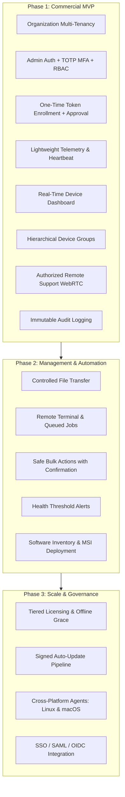

# ControlHub: Product Requirements Document (PRD)

## 1. Product Overview
**Working Product Name**: ControlHub  
**Category**: Authorized B2B Remote Device Monitoring and Management Platform  
**Target Platform (Phase 1)**: Windows 10 / Windows 11 (64-bit)  
**Future Platforms**: Linux (Ubuntu/Debian, RHEL) and macOS (Apple Silicon / Intel)  
**Primary Purpose**: Provide organizations with a secure, centralized console for managing, monitoring, and supporting explicitly enrolled and authorized endpoint computers.

---

## 2. Target Market & Personas

| Target Customer | Use Case Scenario | Key Value Driver |
| :--- | :--- | :--- |
| **Computer Training Centers** | Managing classroom workstations (30-100 PCs per lab), resetting machines, bulk reboot, app distribution | High lab uptime, quick maintenance cycles |
| **Examination Centers** | Secure testing environment verification, process monitoring, hardware checks, lockouts | Tamper resistance, audit trails, guaranteed integrity |
| **Schools & Colleges** | Multi-lab administration, classroom monitoring, bulk power-down schedules | Cost savings, simple centralized control |
| **Small & Medium Businesses (SMBs)**| Fleet monitoring, remote employee workstation troubleshooting, software inventory | Enterprise-grade visibility without complex Active Directory |
| **Managed Service Providers (MSPs)**| Multi-tenant client fleet management, ticket triage, low-latency remote support | Multi-tenant isolation, audit logging, licensing tiers |

---

## 3. Strict Security Boundary & Ethical Guarantees

> [!IMPORTANT]
> ControlHub is strictly an **authorized IT management platform**. The system architecture enforces zero-trust boundaries:
> 1. **Explicit Enrollment Only**: A device is never managed automatically or silently. Management requires explicit installation and one-time cryptographic invitation token validation.
> 2. **No Public Identifier Authentication**: A serial number, hostname, MAC address, or IP address must **never** be sufficient to authenticate a device. Cryptographic device keys (Ed25519) are required.
> 3. **Visible Operations**: When an authorized administrator starts a remote desktop session, a persistent, prominent notification and visual border is shown on the endpoint. Endpoint user consent is supported and configurable by organization policy.
> 4. **Strictly Prohibited**:
>    - No hidden persistence or stealth operation.
>    - No credential harvesting or keystroke logging (keylogger).
>    - No disabling of antivirus or OS security defenses.
>    - No unauthenticated or backdoor remote command execution.
>    - No covert surveillance.

---

## 4. Feature Matrix (Phase 1 MVP vs Future Roadmap)

---

## 5. Functional Requirements

### 5.1 Multi-Tenant Organization Management
- Each organization operates in a siloed logical partition.
- Cross-tenant queries are blocked at the database and API authorization layers.
- Organizations have an owner, configurable global policies, and quota enforcement based on active license tiers.

### 5.2 Role-Based Access Control (RBAC)
Supported standard roles:
1. **Owner**: Full administrative control, billing, license management, organization deletion.
2. **Administrator**: User management, device enrollment, approval, group policies, remote control.
3. **IT Support**: Device troubleshooting, remote session initiation, file transfer, restart.
4. **Operator**: Monitoring view, running approved maintenance jobs, acknowledging alerts.
5. **Viewer**: Read-only access to device dashboards and telemetry statistics.

### 5.3 Secure Device Enrollment
- Administrators generate short-lived, one-time enrollment invitations bound to an organization and optional target group.
- Agent installer accepts the enrollment token, generates local keypair (Ed25519), and transmits the public key over TLS.
- Backend validates token validity, expiration, and use limits. If administrator approval is required by policy, device is placed in `PENDING` status.
- Once approved, device transitions to `ACTIVE`.

### 5.4 Endpoint Health Telemetry & Monitoring
- Periodic lightweight telemetry reporting (every 10–30s configurable).
- Metrics reported:
  - CPU usage (%)
  - Memory usage (used, total, percentage)
  - Disk utilization (per volume free/total)
  - Network state (interfaces, active IP, latency)
  - System info (OS build, hostname, agent version, system uptime)
  - Agent heartbeat
- High-frequency metrics stored in Redis for real-time dashboard display; historical summaries aggregated into PostgreSQL.

### 5.5 Authorized Remote Desktop (WebRTC)
- Admin initiates remote support request.
- Backend verifies operator permissions (`device.remote`).
- Agent validates session authorization token.
- Visible notification banner displayed on endpoint screen: *"ControlHub Remote Support Active - Connected to [Admin Name]"*.
- Screen video transported via peer-to-peer WebRTC (fallback to secure TURN relay).
- Complete session duration, operator identity, and termination events logged to audit trail.

### 5.6 Remote Terminal & Job Queue Pipeline
- No raw, unauthenticated telnet/ssh port open on endpoint.
- All commands processed via transactional job queue:
  `Admin Request` -> `RBAC Check` -> `Policy Validation` -> `Job Created in DB` -> `Dispatched via WebSocket` -> `Agent Validates Signature` -> `Controlled Execution` -> `Exit Code & Output Captured` -> `Audit Log Updated`.

### 5.7 Audit Trail
- System records immutable audit logs for every security-sensitive action:
  - Authentication (success, failure, MFA challenges)
  - Device approvals, status changes, revocations, and deletions
  - Remote desktop session initiations and terminations
  - Command job creations and completions
  - User and permission modifications
