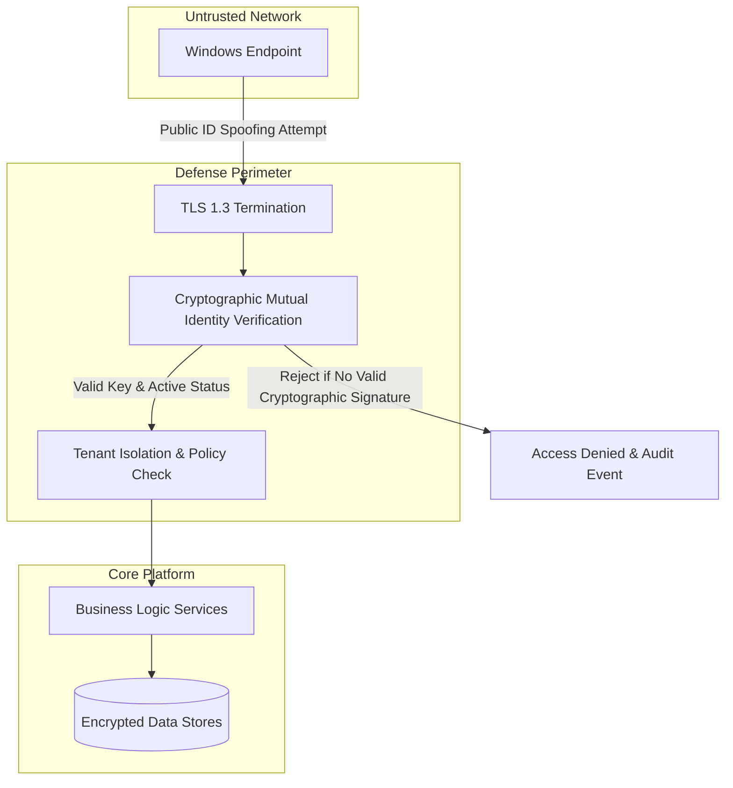
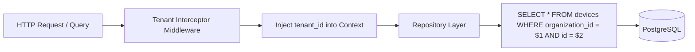

# ControlHub: Security Architecture & Trust Model

## 1. Core Principles & Security Boundary

ControlHub is built under a **Zero-Trust Endpoint Architecture**. Trust is never granted by network locality, IP address, MAC address, hostname, or hardware serial number.



---

## 2. Cryptographic Device Identity

Every enrolled endpoint generates an **Ed25519** public/private keypair at enrollment time:
- **Private Key**: Generated on the endpoint; stored in Windows Data Protection API (`DPAPI`) with `CRYPTPROTECT_LOCAL_MACHINE` flags or Windows Certificate Store / TPM where available. It never leaves the client device.
- **Public Key**: Submitted to the backend during the one-time token enrollment handshake.
- **Authentication Handshake**: When connecting over WebSocket:
  1. Gateway sends a cryptographically random challenge nonce: `Nonce = RandomBytes(32)`.
  2. Agent signs `SHA-256(Nonce || Timestamp || DeviceID)` with its private key.
  3. Gateway verifies signature against the registered public key for that device.
  4. Only upon successful verification is the connection accepted and promoted to `ACTIVE`.

---

## 3. User Authentication & Authorization

### 3.1 Password Security
- Passwords hashed using **Argon2id** with RFC 9106 recommended parameters:
  - Memory: 64 MB (`65536 KiB`)
  - Iterations: 3
  - Parallelism: 4
  - Salt: 16 cryptographically secure random bytes

### 3.2 Multi-Factor Authentication (MFA)
- Time-based One-Time Password (TOTP, RFC 6238).
- Secret generated using `crypto/rand` (base32 encoded, 160-bit entropy).
- Verification enforces strict time-window skew tolerances (±1 step of 30 seconds) and prevents code reuse within the same window.

### 3.3 Token Lifecycle
- **Access Tokens**: Short-lived JSON Web Tokens (JWT, validity: 15 minutes) signed with `EdDSA` or `HMAC-SHA256`.
- **Refresh Tokens**: Opaque cryptographically random 256-bit strings stored in the database with rotation on every use (validity: 7 days).
- **Session Revocation**: Stored in Redis blacklist for immediate invalidation upon logout or administrative revocation.

---

## 4. Multi-Tenant Relational Isolation

> [!CAUTION]
> Frontend filtering is **never** relied upon as a security boundary. All data filtering and authorization is enforced in the backend API and database tier.



- Every table containing customer data has a non-nullable `organization_id UUID REFERENCES organizations(id) ON DELETE CASCADE`.
- Row-Level Security (RLS) policies are configured in PostgreSQL as defense-in-depth:
  ```sql
  ALTER TABLE devices ENABLE ROW LEVEL SECURITY;
  CREATE POLICY tenant_isolation_policy ON devices
    USING (organization_id = CURRENT_SETTING('app.current_tenant_id')::uuid);
  ```

---

## 5. Remote Session Ethics & Endpoint Transparency

Hidden or covert access is strictly prohibited by design:
1. **Prominent Session Border**: When a remote support session is active, the agent renders a bold, high-contrast colored border (e.g. 4px solid neon blue/amber) around the entire screen perimeter using a top-most, click-through-safe desktop window.
2. **Session Overlay Banner**: A non-closable status badge appears at the top center of the screen displaying:
   `ControlHub Remote Control Active | Operator: [Operator Name] | Organization: [Org Name]`
3. **Interactive Consent Mode (Configurable)**: Organizations can enable "Prompt for Consent" policy. In this mode, an incoming remote desktop request pops up a 30-second dialog:
   `"Administrator [Name] wishes to start a remote support session. Allow / Deny?"`
   If the user denies or times out, the session is refused.
4. **End Session Button**: The local user can click "Terminate Session" on the overlay banner at any time to immediately drop the WebRTC connection.

---

## 6. Prohibited Capabilities & Code Verification

ControlHub explicitly excludes:
- Keystroke logging / spyware tracking.
- Stealth hooks, rootkits, or hidden process masking.
- Tampering with Windows Defender, Firewall, or EDR/antivirus tools.
- Arbitrary unauthenticated shell listeners.
