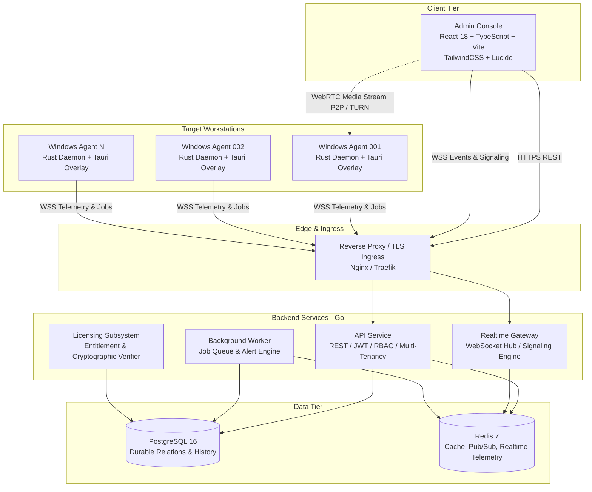
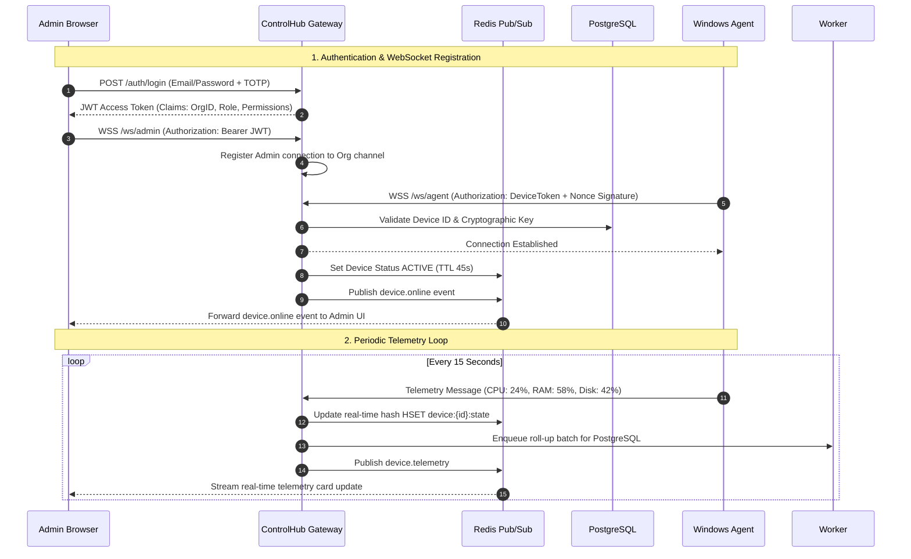

# ControlHub: System Architecture Specification

## 1. High-Level Architecture Overview

ControlHub uses a distributed, modular architecture designed for high concurrency, low-latency telemetry streaming, and resilient multi-tenant isolation.

---

## 2. Technology Stack Selection Rationale

| Component | Technology | Selection Rationale |
| :--- | :--- | :--- |
| **Backend API & Realtime** | **Go (Golang 1.22+)** | Goroutines offer premier concurrency for maintaining tens of thousands of concurrent persistent WebSocket connections; zero-dependency static binaries; rapid startup. |
| **Admin Console** | **React + TypeScript** | Rich component ecosystem for real-time dashboards; type safety; reactive state management with TanStack Query and Zustand. |
| **Windows Agent** | **Rust + Tauri** | Memory safety without garbage collection pauses; native Windows API (`winapi`/`windows-rs`) integration; tiny binary footprint (<15MB); Tauri provides crisp native GUI for connection indicators without Electron bloat. |
| **Primary Database** | **PostgreSQL 16** | Robust ACID compliance; strong relational constraints; JSONB support for flexible telemetry/policy payloads; row-level security capabilities. |
| **Cache & Realtime Bus**| **Redis 7** | Sub-millisecond latency for ephemeral device state, heartbeats, real-time message bus (`Pub/Sub`), and distributed locking. |
| **Realtime Channel** | **WebSocket (WSS)** | Low-overhead bidirectional communication over standard port 443 with TLS encryption. |
| **Remote Screen Transport** | **WebRTC** | Sub-second video latency via UDP/SRTP, adaptive bitrate encoding (VP8/VP9/H.264), end-to-end encryption. |

---

## 3. Communication Protocols & Trust Boundaries

---

## 4. Subsystem Responsibilities

### 4.1 API Service (`services/api`)
- Stateless HTTP REST service.
- Handles user registration, invitation issuance, authentication, session tokens, and organization configuration.
- Enforces strict tenant isolation on every SQL query (`WHERE organization_id = $1`).
- Dispatches transactional commands and device approval state changes.

### 4.2 Realtime Gateway (`services/realtime`)
- Maintains bidirectional WebSocket connections with both Admin browsers and Windows agents.
- Routes telemetry events from agents to corresponding organization admin channels via Redis Pub/Sub.
- Facilitates WebRTC SDP offer/answer/candidate exchange during remote desktop initiation.
- Tracks device liveness via ping/pong heartbeats and automatically broadcasts `device.offline` upon missed heartbeats.

### 4.3 Background Worker (`services/worker`)
- Asynchronous task processing (batch telemetry rollups into Postgres time-buckets).
- Health metric alert rule evaluation (e.g. CPU > 90% for 5 minutes).
- Scheduled maintenance jobs and stale token expiration sweeps.

### 4.4 Windows Agent (`apps/windows-agent`)
- Runs as a secure Windows service (`ControlHubSvc.exe`) with a user-session indicator companion (`ControlHubOverlay.exe`).
- Collects system metrics via Windows Performance Counters / WMI.
- Handles cryptographically signed job payloads and executes them inside an isolated process.
- Implements WebRTC video capture via Windows Desktop Duplication API (DXGI).
