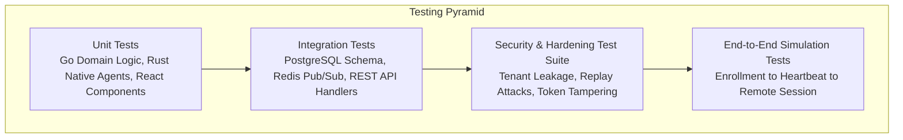

# ControlHub: Testing Strategy & Acceptance Rules

## 1. Milestone Acceptance Rules & Quality Gates

> [!IMPORTANT]
> The engineering team enforces strict milestone completion criteria:
> 1. **No Phantom Features**: Never claim a feature is complete unless both the working implementation and automated tests exist.
> 2. **No Fake UI Mockups**: Never replace production functionality with dead/fake UI buttons that do not interact with the backend.
> 3. **Zero Hardcoded Secrets**: No passwords, JWT secrets, private keys, or credentials stored in code or repository history.
> 4. **Mandatory Test Passes**: Every milestone requires clean test runs before proceeding to the subsequent milestone.
> 5. **Tenant Isolation Verification**: Every backend test suite must verify that Organization A cannot view, query, or mutate resources belonging to Organization B.

---

## 2. Testing Pyramid & Test Architecture



---

## 3. Test Suites & Coverage Requirements

### 3.1 Unit Tests (`tests/unit`)
- **Go Services (`services/api`, `services/realtime`)**:
  - Test Argon2id hash generation and verification.
  - Test TOTP code validation with time-drift allowances.
  - Test JWT token minting, claims parsing, and expiration handling.
  - Test RBAC permission evaluator matrix.
- **Rust Windows Agent (`apps/windows-agent`)**:
  - Test Ed25519 keypair generation and serialization.
  - Test challenge nonce signature generation.
  - Test telemetry metrics sampling sanitization.
- **React Admin Console (`apps/admin-console`)**:
  - Test form validation (Login, MFA, Invitation creation).
  - Test dashboard KPI calculations and real-time state reducer.

### 3.2 Integration Tests (`tests/integration`)
- **Multi-Tenant Isolation**:
  - Create Organization A and Organization B.
  - Issue requests with Org A token against Org B resources (`GET /devices/{orgB_deviceId}`).
  - Assert HTTP `404 Not Found` or `403 Forbidden`.
- **Database Migrations & Constraints**:
  - Execute full UP migrations followed by DOWN migrations.
  - Test foreign key constraints, unique constraints, and cascade delete behavior.
- **Enrollment Flow**:
  - Test token expiration, max-use exhaustion, and cryptographic handshake.

### 3.3 Security Test Suite (`tests/security`)
- **Replay Attack Resistance**: Resend valid signed command payloads with duplicate nonces; verify rejection.
- **Signature Tampering**: Modify 1 byte in the command parameters; verify agent rejects payload.
- **Public Identifier Spoofing**: Attempt to connect using another machine's MAC/IP; verify handshake failure without private key.
- **Rate Limiting**: Flood `/auth/login` with 50 requests; verify HTTP 429 Too Many Requests.

### 3.4 Automated Test Commands
```bash
# Run backend Go unit & integration tests
go test -v -race -cover ./services/... ./packages/...

# Run Rust agent tests
cargo test --manifest-path apps/windows-agent/Cargo.toml

# Run Admin Console tests
npm --prefix apps/admin-console test -- --run

# Run Security Suite
go test -v ./tests/security/...
```
