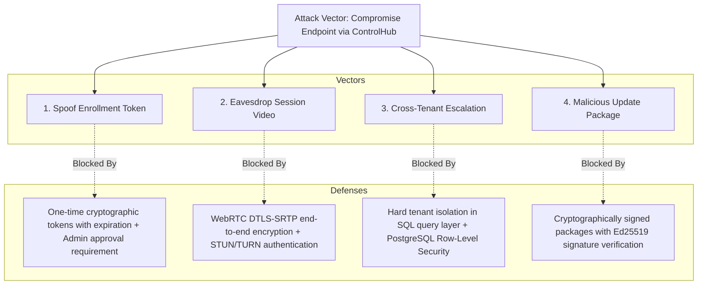

# ControlHub: STRIDE Threat Model & Security Controls

## 1. STRIDE Threat Matrix

| Threat Category | Potential Vector | Impact | Mitigation Strategy in ControlHub |
| :--- | :--- | :--- | :--- |
| **Spoofing** | Attacker spoofs a device using a stolen MAC address, IP, or hostname. | Rogue machine masquerades as authorized workstation. | **Ed25519 Cryptographic Handshake**: Devices authenticate exclusively with cryptographic signatures over a challenge nonce. Public identifiers are ignored for authentication. |
| **Spoofing** | Attacker steals admin credentials to perform unauthorized actions. | Unauthorized access to tenant console. | **MFA (TOTP) enforcement**, rate limiting on `/auth/login`, brute-force lockout, and immediate alert on unknown IP login. |
| **Tampering** | Man-in-the-middle alters command parameters or file transfer paths in transit. | Unintended script execution on endpoint. | **End-to-End TLS 1.3** and cryptographic command signing. Commands carry SHA-256 integrity digests signed by the platform. |
| **Tampering** | Local user modifies agent registry settings or configuration files. | Agent disconnection or bypass of reporting. | Agent configuration is stored under `%ProgramData%\ControlHub` with restricted ACLs allowing access only to `SYSTEM` and `Administrators`. |
| **Repudiation** | Admin claims they did not initiate a remote session or trigger a reboot. | Lack of accountability during incident investigations. | **Append-Only Audit Log**: Every remote session, command, and authorization change writes an immutable audit record with actor ID, IP, user agent, timestamp, and signed hash. |
| **Information Disclosure** | Cross-tenant data leakage via SQL injection or multi-tenant query bugs. | Organization A sees Organization B devices or telemetry. | **Enforced Tenant Scoping**: All database queries parameterize `organization_id`. PostgreSQL Row-Level Security (RLS) acts as secondary defense. Audit logs do not store raw command output or file contents if marked sensitive. |
| **Information Disclosure** | Eavesdropping on remote desktop video feed. | Exposure of sensitive screen information. | **WebRTC DTLS-SRTP Encryption**: Video and data channels are encrypted end-to-end using AES-128-GCM or AES-256-GCM. |
| **Denial of Service** | Malicious agent floods the WebSocket gateway with telemetry packets. | Gateway resource exhaustion, degrading service for other devices. | **Rate Limiting & Connection Throttling**: Leaky-bucket rate limiter per device connection; telemetry accepted at maximum 1 payload per 5 seconds. Excess packets dropped. |
| **Elevation of Privilege** | An Operator user tries to trigger administrative restart or delete a device. | Unauthorized disruptive operation. | **Strict Backend RBAC**: Authorization middleware verifies required granular permissions (`device.restart`, `device.remove`) before controller logic executes. |

---

## 2. Attack Trees & Trust Flow

---

## 3. Defense-in-Depth Implementation Checklist

- [x] **Network Perimeter**: All external traffic strictly terminated on TLS 1.3 with modern cipher suites (`TLS_AES_256_GCM_SHA384`, `TLS_CHACHA20_POLY1305_SHA256`).
- [x] **Secret Storage**: No credentials, API tokens, or private keys committed to source control. Environment variables injected via container orchestrator or secure secret manager.
- [x] **Endpoint Boundary**: Remote desktop displays a prominent visual indicator on screen; endpoint user can disconnect at any time.
- [x] **Audit Durability**: Audit logs are append-only. Modification and deletion APIs are not exposed.
