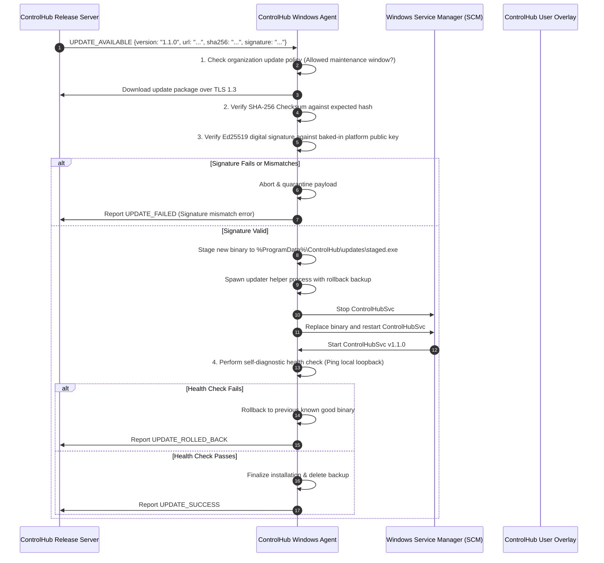

# ControlHub: Secure Agent Update & Installer Subsystem

## 1. Secure Update Workflow

ControlHub uses an automated, fail-safe update pipeline with mandatory cryptographic verification.

---

## 2. Integrity & Cryptographic Signing

- **Release Signing**: Official release binaries are signed using a detached **Ed25519** signature by the ControlHub build pipeline.
- **Root of Trust**: The agent binary embeds the ControlHub Release Authority Public Key in compiled read-only memory.
- **Zero Downgrade Attacks**: The agent verifies that the update version number is strictly greater than the currently installed version, preventing downgrade attacks.

---

## 3. Windows Installer & Service Architecture

The Windows installer (`ControlHub-Setup.exe` / `.msi`) is designed for enterprise deployments via Microsoft Intune, Group Policy (GPO), or manual installation.

### 3.1 Installation Actions
1. **Target Directory**: Installs binaries to `%ProgramFiles%\ControlHub\`.
2. **Protected Storage**: Creates `%ProgramData%\ControlHub\` with restricted NTFS ACLs:
   - `NT AUTHORITY\SYSTEM`: Full Control
   - `BUILTIN\Administrators`: Full Control
   - `BUILTIN\Users`: Read & Execute only (no write/tamper permissions)
3. **Windows Service Registration**:
   - Registers `ControlHubSvc` running under `NT AUTHORITY\SYSTEM`.
   - Startup type: `Automatic` (delayed start supported).
   - Recovery options: Restart service on failure (1 min, 5 min delay).
4. **User Session Companion**:
   - Registers `ControlHubOverlay.exe` in the Run registry key (`HKLM\SOFTWARE\Microsoft\Windows\CurrentVersion\Run`) to launch inside the active interactive user session.
   - Responsible for rendering the top-most visual screen border and consent popups during remote desktop sessions.

### 3.2 Clean Uninstallation & Ethical Transparency
- **Add/Remove Programs**: Properly registered in Windows Apps & Features with publisher name, version, and icon.
- **Uninstall Password / Token**: Can be configured with an administrative uninstall token to prevent unauthorized student/user removal.
- **Complete Clean Removal**: Cleanly terminates services, removes drivers, purges configuration caches, and informs the backend to mark device `REMOVED`.
- **Zero Stealth**: No rootkits, driver disguises, or unkillable watchdog hooks.
